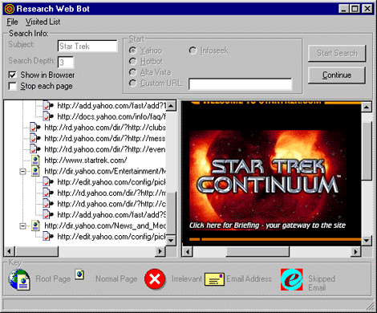

<div align="center">

## Create Your Own Personal Internet Web\-bot


</div>

### Description

Learn how to use the Microsoft Internet Control to create your own custom web-bots that can scour the web for whatever information you're looking for!
 
### More Info
 


<span>             |<span>
---                |---
**Submitted On**   |1999-11-02 21:50:58
**By**             |[Ian Ippolito \(vWorker\)](https://github.com/Planet-Source-Code/PSCIndex/blob/master/ByAuthor/ian-ippolito-vworker.md)
**Level**          |Intermediate
**User Rating**    |4.9 (93 globes from 19 users)
**Compatibility**  |VB 5\.0, VB 6\.0
**Category**       |[Internet/ HTML](https://github.com/Planet-Source-Code/PSCIndex/blob/master/ByCategory/internet-html__1-34.md)
**World**          |[Visual Basic](https://github.com/Planet-Source-Code/PSCIndex/blob/master/ByWorld/visual-basic.md)
**Archive File**   |[CODE\_UPLOAD50534212000\.zip](https://github.com/Planet-Source-Code/ian-ippolito-vworker-create-your-own-personal-internet-web-bot__1-7472/archive/master.zip)


### Source Code

```
From<!img alt="Inside Visual Basic" border="0" src="/vb/tutorial/vb/images/InsideVisualBasic.gif" width="335" height="47">
<a href="http://www.zdjournals.com/ivb/0003/ivb0031.htm">Inside Visual Basic Magazine</a>,<a href="http://www.zdjournals.com/ivb/0003/ivb0031.htm">March 2000<br>
</a>Reposted with Permission of <a href="http://www.zdjournals.com/">ZD Net Journals</a><BR>
<BR>
<table align="right" border="0">
 <tbody>
 <tr>
 <td></td>
 </tr>
 </tbody>
</table>
<p><font face="Verdana">There's no arguing that the Internet lets us access
amazing volumes of information on virtually any subject. However, if you're like
us, you may have found it difficult to filter out unnecessary information from
this enormous repository. Gathering specific facts can be time consuming, with
data usually scattered across many sites. Search engines like Yahoo!, HotBot,
and even Ask Jeeves, have attempted to fill this void, but have been only
partially successful. A recent study found that search engines have indexed less
than 55 percent of the Web. The same study predicted that this percentage would
in fact continue to shrink as the number of new pages on the Internet grows.</font>
<p><font face="Verdana">In the future, people will probably turn to personal,
automated search programs to find what they need. These Web-bots provide more
targeted and thorough searches. In this article, we'll look at the Web-bot shown
in Figure A, which lets you research any topic on the Internet. Then, we'll
cover a few of the basics you'll need to create a Web-bot fit to rival Jeeves
himself!</font>
<h3><font face="Verdana">To boldly go where no Web-bot has gone before</font></h3>
<font face="Verdana">We included both the Web-bot's project files and a compiled
EXE in this month's download. For now, launch the EXE. To begin, enter the
subject you want to research in the Subject text box. For our example, we
satisfied our Star Trek craving.</font>
<p><font face="Verdana">Next, indicate how thorough a search you want the bot to
conduct in the Search Depth text box. High numbers make for in-depth searches,
but take longer to complete. Lower numbers are less thorough but complete much
quicker. If you have a slow Internet connection and only a few minutes to run
the Web-bot, consider entering a 2 or 3. If you have a fast Internet connection
or have a lot of time (for example, you may be running the program over-night),
enter a higher number like 9 or 10. The Web-bot doesn't care how high you make
this number. As you can see in Figure A, we entered 3 for our search depth.</font>
<h3><font face="Verdana">Full speed ahead, botty</font></h3>
<font face="Verdana">Now, select the Show In Browser check box. This option lets
you monitor the bot's progress in the right browser window. The other browsing
check box, Stop Each Page, pauses the Web-bot after each page to allow you to
monitor the results. Chances are, if you want to run the bot unattended, you
won't want to use this option.</font>
<p><font face="Verdana">Finally, tell the Web-bot where to start. Search engines
can be good launching points, so if you want to start with one of these, choose
the corresponding option button. If you want to start at a custom URL, click the
Custom URL option button, and then enter the URL in the text box.</font>
<p><font face="Verdana">Now that we've set the Web-bot's options, we're ready to
launch it. To do so, click Start Search, and then click Yes when the program
asks if you're conducting a new search. That done, the Web-bot races ahead at
warp speed, looking for the information you requested. (OK, that's the last of
the Star Trek references, promise!)</font>
<p><font face="Verdana">At any time, if you wish to take a closer look at a URL,
just click the Pause button. Then, find a URL in the treeview and right-click on
it. Doing so transports the page into the browser on the right side. The program
also logs email addresses, as well as the URLs, in a local Access 97 database
for your later perusal. We called this database WebAgent.mdb.</font>
<h3><font face="Verdana">The anatomy of a Web-bot</font></h3>
<font face="Verdana">Now that we've looked at a working Web-bot, let's take a
look at some of the necessary features that you'll need when you create your
own. For space considerations, we won't get into the form's exact design.
However, Figure A should provide a blueprint for your own layout.</font>
<p><font face="Verdana">In addition to the controls visible at runtime, Figure B
shows the few controls not visible. As you can see, we've placed an ImageList
and Inet control on the form. Also, the larger box at the very bottom is an
RTFTextbox control. Finally, note that in the main body of the Web-bot, we used
a Treeview to list the Web sites and email addresses, and a Browser control to
display the pages. Now, let's take a look at the more complex features.</font>
<p><font face="Verdana"><b>Figure B: </b>We'll import HTML pages into the
RTFTextbox control, and then use its Find method to search the HTML for the
selected topic.<br>
</font>
<h3><font face="Verdana">Navigating to a Web page</font></h3>
<font face="Verdana">The program gains its ability to load Internet Web pages
from the Microsoft Internet control (shdocvw.oca). To use it, simply drop the
control onto a form and use the <code>Navigate</code> method. In our Web-bot,
the function <code>mNavigateToURL</code> accomplishes this task, as well as
provides time-out error trapping and the code to transfer raw HTML to the
RTFTextbox control for later use. Listing A shows the code for this procedure.
Note that <code>vstrURL</code> contains the URL that the Web-bot is currently
analyzing.</font>
<p><font face="Verdana"><b>Listing A: </b>Navigating to a URL</font>
<p><code><font face="Verdana">Function mNavigateToURL(ByRef rIntInternetControl
_</font>
<p><font face="Verdana">As Inet, ByRef rbrwsBrowserControl As WebBrowser, _</font></p>
<p><font face="Verdana">ByRef rrtfTextBox As RichTextBox, ByRef vstrURL _</font></p>
<p><font face="Verdana">As String) As Boolean</font></p>
<p><font face="Verdana">'set default</font></p>
<p><font face="Verdana">mNavigateToURL = False</font></p>
<p><font face="Verdana">On Error GoTo lblOpenError</font></p>
<p><font face="Verdana">rIntInternetControl.URL = vstrURL</font></p>
<p><font face="Verdana">rIntInternetControl.AccessType = icDirect</font></p>
<p><font face="Verdana">frmWebBot.sbWebBot.Panels(1).Text = "Loading "
_</font></p>
<p><font face="Verdana">& vstrURL & "..."</font></p>
<p><font face="Verdana">rrtfTextBox.Text = rIntInternetControl.OpenURL</font></p>
<p><font face="Verdana">frmWebBot.sbWebBot.Panels(1).Text = ""</font></p>
<p><font face="Verdana">On Error GoTo 0</font></p>
<p><font face="Verdana">If (frmWebBot.chkShowInBrowser = vbChecked) Then</font></p>
<p><font face="Verdana">rbrwsBrowserControl.Navigate vstrURL</font></p>
<p><font face="Verdana">End If</font></p>
<p><font face="Verdana">mNavigateToURL = True</font></p>
<p><font face="Verdana">Exit Function</font></p>
<p><font face="Verdana">lblOpenError:</font></p>
<p><font face="Verdana">Select Case (Err.Number)</font></p>
<p><font face="Verdana">Case 35761</font></p>
<p><font face="Verdana">'timeout</font></p>
<p><font face="Verdana">Case Else</font></p>
<p><font face="Verdana">End Select</font></p>
<p><font face="Verdana">End Function</font></code>
<h3><font face="Verdana">Displaying Web pages</font></h3>
<font face="Verdana">Once the Inet control loads a page, the Web-bot needs to
display it in the right pane of the main control panel. The Microsoft Web
Browser control (located in the same control library as the Internet control we
just mentioned) makes it very easy to do so. The following code causes the
browser to display the current page:</font>
<pre><font face="Verdana">rbrwsBrowserControl.Navigate vstrURL</font></pre>
<h3><font face="Verdana">Analyzing a page</font></h3>
<font face="Verdana">After loading and displaying a page, the Web-bot reads it.
Our particular Web-bot requires two different pieces of information:</font>
<p> 
<ul>
 <li><font face="Verdana">The email addresses located on the page.</font>
 <li><font face="Verdana">The links that exit the page, so the Web-bot can
 continue its journey.</font></li>
</ul>
<font face="Verdana">As you'll recall from <code>mNavigateToURL</code>, the
Web-bot stores the raw HTML for the page in a Rich Text Box control, <code>rrtfTextBox</code>.
The control's built in <code>Find</code> method allows the Web-bot to perform
some rudimentary searching, but the procedure must also parse the HTML document
from a specific starting and ending delimiter, and extract the text that lies in
between. We created the <code>mExtractHTML</code> function in Listing B to
accomplish this task. If it finds what it's looking for, it returns the HTML
contents. Otherwise, it returns the empty string.</font>
<p><font face="Verdana"><b>Listing B: </b>The mExtractHTML function</font>
<p><code><font face="Verdana">Function mExtractHTML(ByVal vstrStartDelimiter _</font>
<p><font face="Verdana">As String, ByVal vstrEndDelimiter As String, _</font></p>
<p><font face="Verdana">ByRef rrtfHtml As RichTextBox, ByRef _</font></p>
<p><font face="Verdana">rrlngPageIndex As Long) As String</font></p>
<p><font face="Verdana">Dim lngStringStart As Long</font></p>
<p><font face="Verdana">Dim lngStringEnd As Long</font></p>
<p><font face="Verdana">On Error GoTo lblError</font></p>
<p><font face="Verdana">If (vstrStartDelimiter <> "") Then</font></p>
<p><font face="Verdana">'normal</font></p>
<p><font face="Verdana">rrlngPageIndex = rrtfHtml.Find(vstrStartDelimiter, _</font></p>
<p><font face="Verdana">rrlngPageIndex + 1)</font></p>
<p><font face="Verdana">lngStringStart = rrlngPageIndex + _</font></p>
<p><font face="Verdana">Len(vstrStartDelimiter)</font></p>
<p><font face="Verdana">Else</font></p>
<p><font face="Verdana">'start at current position</font></p>
<p><font face="Verdana">lngStringStart = rrlngPageIndex</font></p>
<p><font face="Verdana">End If</font></p>
<p><font face="Verdana">'find ending delimiter</font></p>
<p><font face="Verdana">rrlngPageIndex = rrtfHtml.Find(vstrEndDelimiter, _</font></p>
<p><font face="Verdana">lngStringStart + 1)</font></p>
<p><font face="Verdana">lngStringEnd = rrlngPageIndex - 1</font></p>
<p><font face="Verdana">'extract text</font></p>
<p><font face="Verdana">rrtfHtml.SelStart = lngStringStart</font></p>
<p><font face="Verdana">rrtfHtml.SelLength = lngStringEnd - lngStringStart + 1</font></p>
<p><font face="Verdana">mExtractHTML = rrtfHtml.SelText</font></p>
<p><font face="Verdana">'set output value</font></p>
<p><font face="Verdana">rrlngPageIndex = lngStringEnd + Len(vstrEndDelimiter)</font></p>
<p><font face="Verdana">On Error GoTo 0</font></p>
<p><font face="Verdana">Exit Function</font></p>
<p><font face="Verdana">lblError:</font></p>
<p><font face="Verdana">mExtractHTML = "ERROR"</font></p>
<p><font face="Verdana">End Function</font></code>
<p><font face="Verdana">The functions <code>mcolGetAllUrlsInPage</code> and <code>mcolExtractAllEmailAddressesOnPage</code>
build on the previous function and return the links or email addresses
(respectively) back to the calling routine via a collection. These functions are
smart enough to remove links and email addresses that might appear valid to a
less sophisticated Web-bot, but really wouldn't be applicable. For example, most
email addresses to mailing lists are of the format subscribe@somedomain.com. The
routine weeds these out. Other examples of screened email addresses include
sales@somedomain.com and support@somedomain.com.</font>
<h3><font face="Verdana">Avoiding infinite loops</font></h3>
<font face="Verdana">Some pages either link back to themselves or link to other
pages that eventually loop back to the original page. If a Web-bot doesn't keep
an eye out for such pages, it can easily fall into an infinite loop. To avoid
this trap, our Web-bot does two things. First, it uses the function <code>mSaveVisitedUrl</code>
to store every URL in the Access database. As you can see if you view the code
in this month's download, this function uses standard ADO code for saving data
to a database.</font>
<p><font face="Verdana">Second, before going to any new URL, it determines if it
already visited the page. To do so, it calls <code>mblnAlreadyVisiting</code>,
shown in Listing C. If the database contains the URL, then the Web-bot skips the
page, thus short-circuiting the infinite loop.</font>
<p><font face="Verdana"><b>Listing C: </b>Code to detect duplicate URL</font>
<p><code><font face="Verdana">Function mblnAlreadyVisiting(ByVal vstrURL As
String)</font>
<p><font face="Verdana">Dim objConnection As ADODB.Connection</font></p>
<p><font face="Verdana">Dim objRecordset As ADODB.Recordset</font></p>
<p><font face="Verdana">'connect to database</font></p>
<p><font face="Verdana">ConnectToDatabase objConnection</font></p>
<p><font face="Verdana">Dim strSQL As String</font></p>
<p><font face="Verdana">strSQL = "SELECT * FROM WebBot_Visited_Url " _</font></p>
<p><font face="Verdana">& "WHERE url='" & vstrURL &
"'"</font></p>
<p><font face="Verdana">Set objRecordset = New ADODB.Recordset</font></p>
<p><font face="Verdana">On Error GoTo lblOpenError</font></p>
<p><font face="Verdana">objRecordset.Open strSQL, objConnection, _</font></p>
<p><font face="Verdana">adOpenForwardOnly, adLockPessimistic</font></p>
<p><font face="Verdana">On Error GoTo 0</font></p>
<p><font face="Verdana">If objRecordset.EOF = False Then</font></p>
<p><font face="Verdana">'found</font></p>
<p><font face="Verdana">mblnAlreadyVisiting = True</font></p>
<p><font face="Verdana">Else</font></p>
<p><font face="Verdana">'not found</font></p>
<p><font face="Verdana">mblnAlreadyVisiting = False</font></p>
<p><font face="Verdana">End If</font></p>
<p><font face="Verdana">'close recordset</font></p>
<p><font face="Verdana">objRecordset.Close</font></p>
<p><font face="Verdana">Set objRecordset = Nothing</font></p>
<p><font face="Verdana">DisconnectFromDatabase objConnection</font></p>
<p><font face="Verdana">Exit Function</font></p>
<p><font face="Verdana">lblOpenError:</font></p>
<p><font face="Verdana">End Function</font></code>
<h3><font face="Verdana">Resuming operation after stopping</font></h3>
<font face="Verdana">Should anything unforeseen happen during a Web-bot search,
such as the operating system crashing or the computer getting switched off, the
search would normally have to be completely rerun. However, this would not be a
happy prospect for someone who was a few hours, or days, into a search, so the
Web-bot code is built to handle this contingency.</font>
<p><font face="Verdana">To allow the user to resume his search, the Web-bot uses
the same URL log that protects against infinite loops to keep track of the
currently visited URL. If the application gets prematurely shut down, it will
simply pick up where it left off.</font>
<h3><font face="Verdana">Conclusion</font></h3>
<font face="Verdana">Web-bots make the Web infinitely more useful because they
allow you to pull in more information than a mere search engine, and allow you
to gather the information into a useful format. The uses for a Web-bot are only
limited by your imagination, and with this article, you now have the tools to
build whatever you can dream</font>
<!/td>
<!/tr>
<!/table>
```

